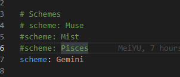

## 使用Hexo搭建一个属于自己的博客网站并使用 Next 模版

> 写在前面：

其实在去年（2018）的时候就已经搭建过博客并写了几篇文章，但是由于当时太忙导致自己连博客的代码写在什么地方都忘记了。现在新开始搭建一个博客分享一些自己项目或者其他地方的一些理解。好了，开始我们第一篇文章的表演。

<!-- more -->

### 博客存放

> 原来我的博客是放在阿里云上的但是发现用处不是很大，没什么人访问最终我还是准备转移到github上。

在 [github](https://github.com) 上去new一个仓库，具体操作还请百度，或者加我QQ“一对一教学”

---

### Hexo 项目构建

1. 全局下载 [hexo-cli](https://hexo.io/zh-cn/docs/) 
2. 下载完毕以后，请记得先去看下命令操作，以最新的文档为准，[命令说明](https://hexo.io/zh-cn/docs/commands)
3. 看完命令，在命令行工具里面输入 `hexo s --debug` 启动我们的服务

网页显示这个的时候就说明初步的工作完成
4. 启动完成没有问题，然后我们来修改下主题，先找到根目录下的 `_config.yml` 文件，再找到 `theme` 替换成图片这样

，再把 `next目录下的_config.yml` 

这个修改一下，一共四种，自己换一种喜欢的
 ，当然你也可以选择[其他主题](https://hexo.io/themes/)

---

### 博客部署

#### 注意两点

1. 需要注意的地方就是 `根目录下的_config.yml` 网址部分的路径配置一定要搞清楚，不然很容易导致项目中css和js加载不出来的情况

，这里一定要注意下，[具体说明请看文档](https://hexo.io/zh-cn/docs/configuration#%E7%BD%91%E7%AB%99)

因为我项目路径是属于 `https://github.com/MrMeiyu/my-blog` 二级路由，所以我这里会写成 `/my-blog` ，如果有的小伙伴直接是一级路由的话，就写成 `/` 就好了

2. 就是git部署地址一定要写对，还有如果你的分支没有构建也不需要管它，按照我的分支来就写好了。

,[具体说明请看文档](https://hexo.io/zh-cn/docs/deployment)

---

以上就是 `使用Hexo搭建一个属于自己的博客网站并使用 Next 模版` ，如果还有不懂的朋友请QQ联系我