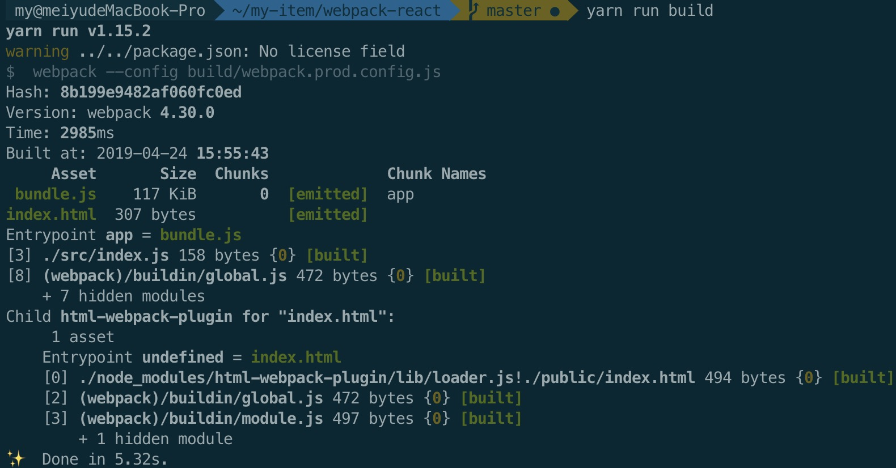
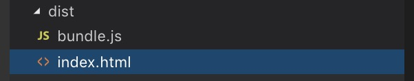
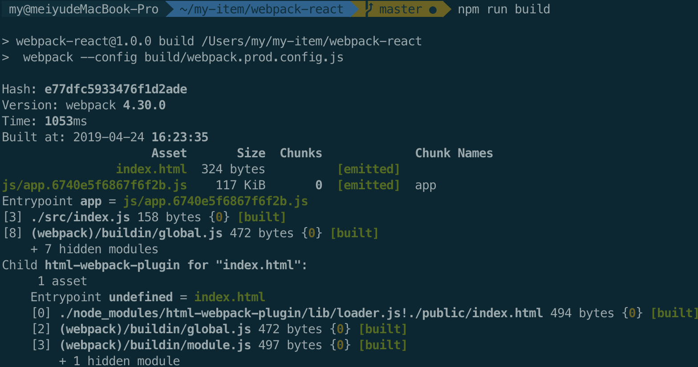
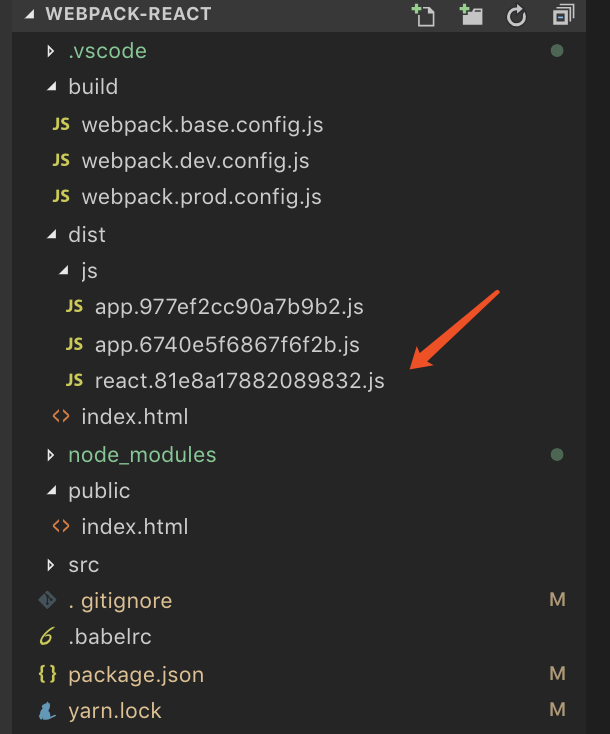

## 使用webpack4搭建react 第二章

> 这篇属于优化篇，基础篇请前往这里 [点击我](https://mrmeiyu.github.io/my-blog/2019/04/23/%E6%89%8B%E6%8A%8A%E6%89%8B%E6%95%99%E4%BD%A0%E7%94%A8webpack4%E6%90%AD%E5%BB%BAreact%E6%A1%86%E6%9E%B6%EF%BC%88%E5%9F%BA%E7%A1%80%E7%AF%87%EF%BC%89/)

1. 整合html-webpack-plugin

主要是 `public - index.html` 这个文件需要自己主动生成，且js也是自己添加，所以我们用到了这个插件

- 首先下载插件 `yarn add html-webpack-plugin -D`
- 然后在 `build - webpack.prod.config.js` 这个文件中配置plugin
```
  const merge = require('webpack-merge')
  const baseWebpackConfig = require('./webpack.base.config')
  // html-webpack-plugin其他参数 https://webpack.docschina.org/plugins/html-webpack-plugin/#%E5%9F%BA%E6%9C%AC%E7%94%A8%E6%B3%95
  const HtmlWebpackPlugin = require('html-webpack-plugin')

  module.exports = merge(baseWebpackConfig, {
    mode: 'production',
    plugins: [
      new HtmlWebpackPlugin({
        template: 'public/index.html',
        inject: 'body',
        minify: { // 其他参数 https://github.com/kangax/html-minifier#options-quick-reference
          removeComments: true, // 剥离HTML评论
          collapseWhitespace: true, // 折叠有助于文档树中文本节点的空白区域
          removeAttributeQuotes: true // 尽可能删除属性周围的引号
        }
      })
    ]
  })
```
- 测试一下，先删除 `index.html` 中的 script 标签
- 重新编译一次 `yarn run build`，编译完以后结果如下

然后目录中会多出一个 `index.html` 文件

这样感觉层级不是很友好，所以我们需要再改下目录的层级，
找到 `webpack.base.config.js` 修改 `output` 中代码
```
  output: {
    filename: 'js/bundle.js', // 这里是做一个修改
    path: OUTPUT_PATH
  },
```
再重新编译一下，执行 `yarn run build` 就可以了

2. 写代码的时候可能会出现文件或者文件夹名字重复的问题，所以我们这是需要用到 hash；更重要的一点是解决浏览器缓存的问题
找到 `webpack.base.config.js` 修改 `output` 中代码
```
  output: {
    filename: 'js/[name].[chunkhash:16].js', // 这里是做一个修改
    path: OUTPUT_PATH
  },
```

3. 刚才提到文件重复的问题，这里还有一个解决方案就是每次编译以前先清理dist目录，如果不清理的话，会导致文件很多且内容其实是一样，为什么会这样，原因就是因为我们加入了hash所以导致里面的文件会很多

- 首先下载插件 `yarn add clean-webpack-plugin -D`
- 然后在 `build - webpack.prod.config.js` 这个文件中配置plugin
```
  const merge = require('webpack-merge')
  // html-webpack-plugin https://webpack.docschina.org/plugins/html-webpack-plugin/#%E5%9F%BA%E6%9C%AC%E7%94%A8%E6%B3%95
  const HtmlWebpackPlugin = require('html-webpack-plugin')
  // clean-webpack-plugin https://webpack.docschina.org/guides/output-management/#%E6%B8%85%E7%90%86-dist-%E6%96%87%E4%BB%B6%E5%A4%B9
  const CleanWebpackPlugin = require('clean-webpack-plugin')

  const baseWebpackConfig = require('./webpack.base.config')

  module.exports = merge(baseWebpackConfig, {
    mode: 'production',
    plugins: [
      new HtmlWebpackPlugin({
        template: 'public/index.html',
        inject: 'body',
        minify: { // 其他参数 https://github.com/kangax/html-minifier#options-quick-reference
          removeComments: true, // 剥离HTML评论
          collapseWhitespace: true, // 折叠有助于文档树中文本节点的空白区域
          removeAttributeQuotes: true // 尽可能删除属性周围的引号
        }
      }),
      new CleanWebpackPlugin({
        // 其他参数 https://github.com/johnagan/clean-webpack-plugin#options-and-defaults-optional
        dry: true,
        verbose: true
      })
    ]
  })
```
编译一下 `yarn run build`


4. 抽离业务代码

为什么抽离，原因很简单，我们不可能每次都去编译不变的代码，比如：react、react-dom等，所以我们需要抽离这些

- 首先我们需要在 `webpack.base.config.js` 再添加一个入口文件
```
  const path = require('path') // path是属于node的一个模块
  const OUTPUT_PATH = path.resolve(__dirname, '../dist')
  const APP_PATH = path.resolve(__dirname, '../src')

  module.exports = {
    entry: {
      app: './src/index.js',
      // 以下为新增
      react: [
        'react',
        'react-dom'
      ]
    },
    output: {
      filename: 'js/[name].[chunkhash:16].js',
      path: OUTPUT_PATH
    },
    module: {
      rules: [
        {
          test: /\.js?$/,
          use: 'babel-loader',
          include: [APP_PATH]
        }
      ]
    }
  }
```
我们在重新打包一下，

得确是另外打了一个包出来，但细心的你可能会发现 `app.js` 并没有减少，这里 `webpack4` 使用配置 `optimization.splitChunks` 的方式来抽离代码
```
  const merge = require('webpack-merge')
  // html-webpack-plugin https://webpack.docschina.org/plugins/html-webpack-plugin/#%E5%9F%BA%E6%9C%AC%E7%94%A8%E6%B3%95
  const HtmlWebpackPlugin = require('html-webpack-plugin')
  // clean-webpack-plugin https://webpack.docschina.org/guides/output-management/#%E6%B8%85%E7%90%86-dist-%E6%96%87%E4%BB%B6%E5%A4%B9
  const CleanWebpackPlugin = require('clean-webpack-plugin')

  const baseWebpackConfig = require('./webpack.base.config')

  module.exports = merge(baseWebpackConfig, {
    mode: 'production',
    optimization: {
      splitChunks: {
        chunks: 'all',
        minChunks: 1,
        minSize: 0,
        cacheGroups: {
          react: {
            test: 'react',
            name: 'react',
            enforce: true
          }
        }
      }
    },
    plugins: [
      new HtmlWebpackPlugin({
        template: 'public/index.html',
        inject: 'body',
        minify: { // 其他参数 https://github.com/kangax/html-minifier#options-quick-reference
          removeComments: true, // 剥离HTML评论
          collapseWhitespace: true, // 折叠有助于文档树中文本节点的空白区域
          removeAttributeQuotes: true // 尽可能删除属性周围的引号
        }
      }),
      new CleanWebpackPlugin({
        // 其他参数 https://github.com/johnagan/clean-webpack-plugin#options-and-defaults-optional
        dry: true,
        verbose: true
      })
    ]
  })
```

5. 压缩文件

还是在 `optimization` 配置，不过这次我们需要用到一个插件 `uglifyjs-webpack-plugin`

- 下载插件 `yarn add uglifyjs-webpack-plugin -D`
- 引入插件
```
  const UglifyJSPlugin = require('uglifyjs-webpack-plugin')
```
- 配置插件 `optimization - minimizer`
```
  minimizer: [
    new UglifyJSPlugin()
  ],
```
重新编译一下 `npm run build`

6. 配置本地开发环境

- 安装 `yanr add webpack-dev-server -D`
- 找到 `build - webpack.dev.config.js` 加入一下代码
```
  const path = require('path')
  const webpack = require('webpack')
  const merge = require('webpack-merge')
  const baseWebpackConfig = require('./webpack.base.config.js')
  const HtmlWebpackPlugin = require('html-webpack-plugin')

  module.exports = merge(baseWebpackConfig, {
    mode: 'development',
    output: {
      filename: 'js/[name].[hash:16].js',
    },
    plugins: [
      new HtmlWebpackPlugin({
        template: 'public/index.html',
        inject: 'body',
        minify: {
          html5: true,
        },
        hash: false,
      }),
      new webpack.HotModuleReplacementPlugin(),
    ],
    devServer: {
      port: '8080',
      contentBase: path.join(__dirname, '../public'),
      compress: true,
      historyApiFallback: true,
      hot: true, // 热更新 并引入 HotModuleReplacementPlugin 插件
      https: false,
      noInfo: true,
      open: true,
      proxy: {},
    },
  })
```
有了本地服务，我们还需要热更新，先修改 `devServer.hot: true`并在plugins中引入 HotModuleReplacementPlugin 插件，开启热更新，记得替换hash
- 在 `package.json` 文件中增加一个npm scripts
```
  "dev": "webpack-dev-server --inline --progress --config build/webpack.dev.config.js"
```
- 上面配置完成在命令行中输入 `yarn run dev`，就会自动开启本地服务