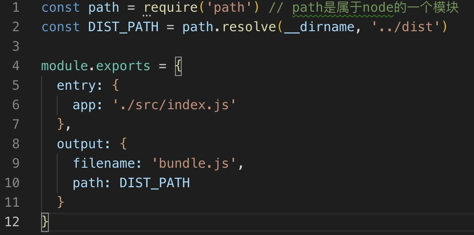

## 使用webpack4搭建react 第一章

首先要先去了解下 [webpack](https://webpack.docschina.org/concepts/)，基本的就不多再介绍了。

然后开始我们的 `webpack` 配置：

<!-- more -->

1. 再命令行中输入 `npm init`,当然那也可以使用 `npm init -y` -y 的意义就不需要自己一个一个去填写。

mkdir 创建文件夹，cd 进入文件夹，然后你看到生成 `package.json` 这个文件就成功了
2. 然后新建一些文件，具体目录结构大致如下：

3. 下载依赖，因为 `webpack4.0` 是把 webpack 和 webpack-cli 分开了
```
  // 这里我使用的是 facebook 的 yarn webpack-dev-server 本地启动项目的服务插件

  yarn add webpack webpack-cli webpack-dev-server -D

  // 如果你需要使用npm

  npm install webpack webpack-cli -D
```
4. 然后在 `build` 文件夹下找到 `webpack.base.config.js` 进行基础的配置，


5. webpack4.0以上的版本增加了 mode 的模式。主要是用于不同的环境选项，有个高级的配置地址你可能需要了解一下 [点击我](https://webpack.docschina.org/configuration)

接着我们需要用到一个插件来组织下 `webpack` 的基础配置和不同环境，
```
  yarn add webpack-merge -D

  // 下载成功来以后,我们打开 `webpack.prod.config.js` ，编辑代码

  const merge = require('webpack-merge')
  const baseWebpackConfig = require('./webpack.base.conf')
  module.exports = merge(baseWebpackConfig, {
    mode: 'production'
  })
```
然后分别在 `src - index.js` 的文件写入
```
  var ele = document.getElementById('root')
  ele.innerHTML = 'hello world'
```
然后在 `public 新建一个index.html文件` 写入
```
  <!DOCTYPE html>
  <html lang="en">
  <head>
    <meta charset="UTF-8">
    <meta name="viewport" content="width=device-width, initial-scale=1.0">
    <meta http-equiv="X-UA-Compatible" content="ie=edge">
    <title>手把手教你用webpack4搭建react框架（基础篇）</title>
  </head>
  <body>
    <div id="root"></div>
    <script src="../dist/bundle.js"></script>
  </body>
  </html>
```
然后就需要打包测试我们写的对不对了，在命令行中输入 ` webpack --config build/webpack.prod.config.js`，

虽然成功，但是感觉很麻烦，所以我们来改进下，找到根目录下的 `package.json` 文件，

在命令行中输入 `npm run build` 结果和上面是一样的

6. 安装react

在命令行中输入 `yarn add react react-dom --save`

安装完成以后我们在 `src - index.js` 文件直接使用react
```
  import React from 'react'
  import ReactDom from 'react-dom'

  ReactDom.render(
    <h1>hello world</h1>,
    document.getElementById('root')
  )
```
写入以上代码，然后执行打包 `npm run build`，这时会报错

为啥会报错？因为 `webpack` 只识别JavaScript文件，而且只能编译es5版本的JavaScript语法。实际上，我们使用ES2015，以及jsx的语法糖，webpack它根本不认识。
然后我们就需要用到 `loader` 来做预处理文件了。常用的就是 `babel-loader` 把ES2015+的语法转换成ES5的语法

4. 安装babel
 
首先我们安装 `babel` 的模块，在命令行中输入
`yarn add babel-loader @babel/preset-react @babel/preset-env @babel/core -D`，为啥会下这么多的包，因为其中@babel/core是babel 的核心模块，@babel/preset-env 是转译ES2015+的语法，@babel/preset-react是转译react的JSX以及FLOW，如果还有其他问题不了解的可以 [进入官网](https://www.babeljs.cn/)

然后我们还需要在根目录下创建一个 `.babelrc` 的文件，用于配置 presets，
```
  {
    "presets": [
      [
        "@babel/preset-env",
        {
          "targets": {
            "browsers": [
              "> 1%",
              "last 5 versions",
              "ie >= 8"
            ]
          }
        }
      ],
      "@babel/preset-react"
    ]
  }
```
[API详情](http://babeljs.io/docs/en)

接着我们再去载入babel-loader，修改 `webpack.base.config.js` 文件
```
  const path = require('path') // path是属于node的一个模块
  const APP_PATH = path.resolve(__dirname, '../src')
  const DIST_PATH = path.resolve(__dirname, '../dist')

  module.exports = {
    entry: {
      app: './src/index.js'
    },
    output: {
      filename: 'bundle.js',
      path: DIST_PATH
    },
    module: {
      rules: [
        {
          test: /\.js?$/,
          use: 'babel-loader',
          include: APP_PATH
        }
      ]
    }
  }
```

重新编译，就OK了。

最后我把项目的接口改了一下，大致是这样的

基本的需求已经完成了。接下来会优化一下框架

然后源码在这里 [base-first分支中](https://github.com/MrMeiyu/webpack4.0-react/tree/base-first)
